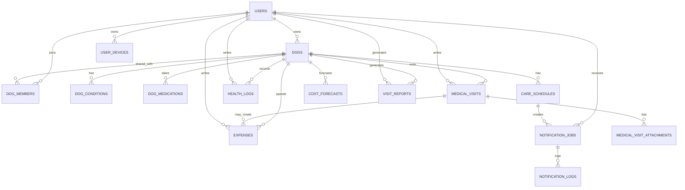

# PawPlan DB 테이블 설계

작성일: 2026-04-21  
기준 DBMS: PostgreSQL 15+

---

## 1. 설계 목표

PawPlan의 DB는 아래 4가지를 안정적으로 지원해야 한다.

- 반려견별 프로필과 건강 배경 정보 저장
- 예방 일정, 생활 기록, 병원 기록의 통합 관리
- 지출 기록과 비용 예측 결과 관리
- 병원 방문 리포트 생성에 필요한 데이터 집계

이번 설계는 `MVP 기준의 실서비스형 구조`를 목표로 한다.  
즉, 당장 구현하는 기능은 단순하게 유지하되 `가족 공유`, `파일 첨부`, `예측 리포트`, `서버 푸시 알림` 정도까지는 무리 없이 확장될 수 있도록 잡는다.

---

## 2. 설계 원칙

- `반려견(dog)`이 핵심 엔터티다.
- 대부분의 데이터는 `dog_id`를 기준으로 연결된다.
- 병원 기록과 생활 기록은 화면에서는 한 타임라인으로 보이지만, DB에서는 `medical_visits`와 `health_logs`로 분리한다.
- 비용 예측은 계산 결과를 매번 즉석 계산할 수도 있지만, 보고서·비교를 위해 스냅샷 테이블을 둔다.
- 첨부 파일은 여러 곳에서 재사용될 수 있으므로 별도 테이블로 분리한다.
- 향후 다견 가구, 가족 공유, 보험 연동을 고려해 `users`와 `dog_members` 구조를 둔다.
- 첫 온보딩은 여러 테이블에 나뉘어 저장되더라도 서버 내부에서는 하나의 초기화 트랜잭션으로 처리한다.
- 병원비의 단일 기준 데이터는 `expenses`로 통일하고, `medical_visits`는 진료 내용 중심으로 관리한다.
- MVP 알림은 Flutter 로컬 알림으로 처리하므로 서버 DB에 알림 작업 테이블을 필수로 두지 않는다.

---

## 3. 엔터티 개요

### 3.1 핵심 테이블

- `users`: 사용자 계정
- `dogs`: 반려견 기본 정보
- `dog_conditions`: 알레르기, 기저질환 등 건강 상태
- `dog_medications`: 현재 복용약 정보
- `care_schedules`: 예방·검진·케어 일정
- `health_logs`: 식단, 체중, 산책, 증상 등 생활/건강 로그
- `medical_visits`: 병원 방문 기록
- `expenses`: 지출 기록
- `cost_forecasts`: 예상 비용 스냅샷
- `visit_reports`: 병원 방문 요약 리포트

### 3.2 2차 확장 테이블

- `dog_members`: 반려견 공유 멤버
- `medical_visit_attachments`: 영수증, 처방전, 검사 결과 첨부
- `user_devices`: 사용자 디바이스 및 푸시 토큰
- `notification_jobs`: 발송 예정 알림 작업
- `notification_logs`: 알림 발송 이력

### 3.3 관계 요약

- 한 명의 사용자(`users`)는 여러 마리의 반려견(`dogs`)을 가질 수 있다.
- 한 마리의 반려견은 2차 확장 시 여러 명의 보호자(`dog_members`)와 공유될 수 있다.
- 한 마리의 반려견은 여러 개의 건강 상태, 일정, 로그, 병원 방문, 지출, 리포트를 가진다.
- 병원 방문 기록은 첨부 파일과 지출 내역과 연결될 수 있다.

---

## 4. ERD 개요

아래 ERD는 MVP 핵심 테이블과 2차 확장 테이블을 함께 보여준다.  
첫 개발 착수 범위에서는 `user_devices`, `notification_jobs`, `notification_logs`, `dog_members`를 생략할 수 있다.

---

## 5. 테이블 상세 설계

## 5.1 `users`

사용자 계정 테이블이다.

| 컬럼명        | 타입         | 제약                        | 설명                            |
| ------------- | ------------ | --------------------------- | ------------------------------- |
| id            | BIGSERIAL    | PK                          | 사용자 ID                       |
| email         | VARCHAR(255) | UNIQUE, NOT NULL            | 로그인 이메일                   |
| password_hash | VARCHAR(255) | NOT NULL                    | 암호화된 비밀번호               |
| name          | VARCHAR(100) | NOT NULL                    | 사용자 이름                     |
| phone         | VARCHAR(20)  | NULL                        | 연락처                          |
| status        | VARCHAR(20)  | NOT NULL DEFAULT `'active'` | `active`, `inactive`, `blocked` |
| last_login_at | TIMESTAMPTZ  | NULL                        | 마지막 로그인 시각              |
| created_at    | TIMESTAMPTZ  | NOT NULL DEFAULT NOW()      | 생성 시각                       |
| updated_at    | TIMESTAMPTZ  | NOT NULL DEFAULT NOW()      | 수정 시각                       |

인덱스:

- `uq_users_email(email)`

---

## 5.2 `dogs`

반려견 기본 정보를 저장한다. 앱의 핵심 기준 테이블이다.

| 컬럼명            | 타입         | 제약                        | 설명                          |
| ----------------- | ------------ | --------------------------- | ----------------------------- |
| id                | BIGSERIAL    | PK                          | 반려견 ID                     |
| primary_owner_id  | BIGINT       | FK -> users.id, NOT NULL    | 주 보호자                     |
| name              | VARCHAR(100) | NOT NULL                    | 반려견 이름                   |
| breed             | VARCHAR(100) | NOT NULL                    | 품종                          |
| birth_date        | DATE         | NULL                        | 생년월일                      |
| sex               | VARCHAR(10)  | NOT NULL                    | `male`, `female`, `unknown`   |
| neutered          | BOOLEAN      | NOT NULL DEFAULT FALSE      | 중성화 여부                   |
| current_weight_kg | NUMERIC(5,2) | NULL                        | 현재 체중                     |
| target_weight_kg  | NUMERIC(5,2) | NULL                        | 목표 체중                     |
| activity_level    | VARCHAR(20)  | NOT NULL DEFAULT `'medium'` | `low`, `medium`, `high`       |
| insurance_status  | VARCHAR(20)  | NOT NULL DEFAULT `'none'`   | `none`, `enrolled`, `planned` |
| photo_url         | TEXT         | NULL                        | 프로필 이미지                 |
| notes             | TEXT         | NULL                        | 메모                          |
| created_at        | TIMESTAMPTZ  | NOT NULL DEFAULT NOW()      | 생성 시각                     |
| updated_at        | TIMESTAMPTZ  | NOT NULL DEFAULT NOW()      | 수정 시각                     |

인덱스:

- `idx_dogs_primary_owner_id(primary_owner_id)`
- `idx_dogs_breed(breed)`

---

## 5.3 `dog_members`

가족 공유나 공동 보호자 기능을 위한 테이블이다.

| 컬럼명      | 타입        | 제약                           | 설명                           |
| ----------- | ----------- | ------------------------------ | ------------------------------ |
| id          | BIGSERIAL   | PK                             | 공유 멤버 ID                   |
| dog_id      | BIGINT      | FK -> dogs.id, NOT NULL        | 반려견 ID                      |
| user_id     | BIGINT      | FK -> users.id, NOT NULL       | 사용자 ID                      |
| role        | VARCHAR(20) | NOT NULL DEFAULT `'caregiver'` | `owner`, `caregiver`, `viewer` |
| invited_at  | TIMESTAMPTZ | NOT NULL DEFAULT NOW()         | 초대 시각                      |
| accepted_at | TIMESTAMPTZ | NULL                           | 수락 시각                      |
| created_at  | TIMESTAMPTZ | NOT NULL DEFAULT NOW()         | 생성 시각                      |

제약:

- `UNIQUE (dog_id, user_id)`

인덱스:

- `idx_dog_members_user_id(user_id)`

---

## 5.4 `dog_conditions`

알레르기, 기저질환, 과거 질환, 주의 질환 등을 저장한다.

| 컬럼명         | 타입         | 제약                        | 설명                                                         |
| -------------- | ------------ | --------------------------- | ------------------------------------------------------------ |
| id             | BIGSERIAL    | PK                          | 상태 ID                                                      |
| dog_id         | BIGINT       | FK -> dogs.id, NOT NULL     | 반려견 ID                                                    |
| condition_type | VARCHAR(30)  | NOT NULL                    | `allergy`, `chronic`, `past_history`, `risk_factor`, `other` |
| condition_name | VARCHAR(100) | NOT NULL                    | 상태명                                                       |
| severity       | VARCHAR(20)  | NULL                        | `low`, `medium`, `high`                                      |
| diagnosed_on   | DATE         | NULL                        | 진단 시점                                                    |
| status         | VARCHAR(20)  | NOT NULL DEFAULT `'active'` | `active`, `resolved`, `monitoring`                           |
| notes          | TEXT         | NULL                        | 메모                                                         |
| created_at     | TIMESTAMPTZ  | NOT NULL DEFAULT NOW()      | 생성 시각                                                    |
| updated_at     | TIMESTAMPTZ  | NOT NULL DEFAULT NOW()      | 수정 시각                                                    |

인덱스:

- `idx_dog_conditions_dog_id(dog_id)`
- `idx_dog_conditions_type(condition_type)`

---

## 5.5 `dog_medications`

현재 복용 중인 약, 영양제, 처방약 정보를 저장한다.

| 컬럼명          | 타입         | 제약                    | 설명             |
| --------------- | ------------ | ----------------------- | ---------------- |
| id              | BIGSERIAL    | PK                      | 약물 ID          |
| dog_id          | BIGINT       | FK -> dogs.id, NOT NULL | 반려견 ID        |
| medication_name | VARCHAR(120) | NOT NULL                | 약물명           |
| dosage          | VARCHAR(50)  | NULL                    | 복용량           |
| frequency_text  | VARCHAR(100) | NULL                    | 예: 하루 2회     |
| started_on      | DATE         | NULL                    | 시작일           |
| ended_on        | DATE         | NULL                    | 종료일           |
| prescribed_by   | VARCHAR(100) | NULL                    | 처방 병원/수의사 |
| is_active       | BOOLEAN      | NOT NULL DEFAULT TRUE   | 현재 복용 여부   |
| notes           | TEXT         | NULL                    | 메모             |
| created_at      | TIMESTAMPTZ  | NOT NULL DEFAULT NOW()  | 생성 시각        |
| updated_at      | TIMESTAMPTZ  | NOT NULL DEFAULT NOW()  | 수정 시각        |

인덱스:

- `idx_dog_medications_dog_id(dog_id)`
- `idx_dog_medications_active(is_active)`

---

## 5.6 `care_schedules`

예방접종, 구충, 심장사상충, 건강검진, 치과관리, 미용 일정 등을 저장한다.

| 컬럼명            | 타입         | 제약                         | 설명                                                                                        |
| ----------------- | ------------ | ---------------------------- | ------------------------------------------------------------------------------------------- |
| id                | BIGSERIAL    | PK                           | 일정 ID                                                                                     |
| dog_id            | BIGINT       | FK -> dogs.id, NOT NULL      | 반려견 ID                                                                                   |
| schedule_type     | VARCHAR(30)  | NOT NULL                     | `vaccine`, `deworming`, `heartworm`, `checkup`, `dental`, `grooming`, `medication`, `other` |
| title             | VARCHAR(120) | NOT NULL                     | 일정 제목                                                                                   |
| description       | TEXT         | NULL                         | 설명                                                                                        |
| due_date          | DATE         | NOT NULL                     | 예정일                                                                                      |
| repeat_cycle_days | INTEGER      | NULL                         | 반복 주기(일)                                                                               |
| priority          | VARCHAR(20)  | NOT NULL DEFAULT `'medium'`  | `low`, `medium`, `high`                                                                     |
| status            | VARCHAR(20)  | NOT NULL DEFAULT `'pending'` | `pending`, `completed`, `skipped`, `overdue`                                                |
| source_type       | VARCHAR(20)  | NOT NULL DEFAULT `'system'`  | `system`, `manual`                                                                          |
| completed_at      | TIMESTAMPTZ  | NULL                         | 완료 시각                                                                                   |
| reminder_enabled  | BOOLEAN      | NOT NULL DEFAULT TRUE        | 알림 여부                                                                                   |
| last_reminded_at  | TIMESTAMPTZ  | NULL                         | 마지막 알림 발송 시각                                                                       |
| created_by        | BIGINT       | FK -> users.id, NULL         | 생성자                                                                                      |
| created_at        | TIMESTAMPTZ  | NOT NULL DEFAULT NOW()       | 생성 시각                                                                                   |
| updated_at        | TIMESTAMPTZ  | NOT NULL DEFAULT NOW()       | 수정 시각                                                                                   |

인덱스:

- `idx_care_schedules_dog_id(dog_id)`
- `idx_care_schedules_due_date(due_date)`
- `idx_care_schedules_status(status)`
- `idx_care_schedules_type(schedule_type)`

---

## 5.7 `health_logs`

식단, 체중, 산책, 증상, 메모 등의 타임라인 로그를 저장한다.

| 컬럼명        | 타입          | 제약                    | 설명                                                               |
| ------------- | ------------- | ----------------------- | ------------------------------------------------------------------ |
| id            | BIGSERIAL     | PK                      | 로그 ID                                                            |
| dog_id        | BIGINT        | FK -> dogs.id, NOT NULL | 반려견 ID                                                          |
| log_type      | VARCHAR(30)   | NOT NULL                | `meal`, `weight`, `walk`, `symptom`, `note`, `medication`, `other` |
| title         | VARCHAR(120)  | NULL                    | 제목                                                               |
| recorded_at   | TIMESTAMPTZ   | NOT NULL                | 기록 시점                                                          |
| value_numeric | NUMERIC(10,2) | NULL                    | 수치값                                                             |
| value_unit    | VARCHAR(20)   | NULL                    | 단위                                                               |
| memo          | TEXT          | NULL                    | 메모                                                               |
| metadata      | JSONB         | NULL                    | 로그별 상세 데이터                                                 |
| created_by    | BIGINT        | FK -> users.id, NULL    | 작성자                                                             |
| created_at    | TIMESTAMPTZ   | NOT NULL DEFAULT NOW()  | 생성 시각                                                          |
| updated_at    | TIMESTAMPTZ   | NOT NULL DEFAULT NOW()  | 수정 시각                                                          |

예시 `metadata`:

- `meal`: 사료명, 급여량, 간식 여부
- `walk`: 산책 시간, 거리, 강도
- `symptom`: 증상 종류, 지속 시간

인덱스:

- `idx_health_logs_dog_id(dog_id)`
- `idx_health_logs_recorded_at(recorded_at DESC)`
- `idx_health_logs_type(log_type)`
- `idx_health_logs_metadata_gin(metadata)` using GIN

---

## 5.8 `medical_visits`

병원 방문, 진료, 검사, 수술 이력을 저장한다.

| 컬럼명            | 타입         | 제약                    | 설명             |
| ----------------- | ------------ | ----------------------- | ---------------- |
| id                | BIGSERIAL    | PK                      | 방문 ID          |
| dog_id            | BIGINT       | FK -> dogs.id, NOT NULL | 반려견 ID        |
| hospital_name     | VARCHAR(150) | NOT NULL                | 병원명           |
| veterinarian_name | VARCHAR(100) | NULL                    | 수의사명         |
| visit_date        | TIMESTAMPTZ  | NOT NULL                | 방문 일시        |
| visit_reason      | VARCHAR(150) | NULL                    | 방문 사유        |
| symptoms          | TEXT         | NULL                    | 증상             |
| diagnosis         | TEXT         | NULL                    | 진단 내용        |
| treatment         | TEXT         | NULL                    | 치료 내용        |
| prescribed_items  | TEXT         | NULL                    | 처방약/처방 내용 |
| follow_up_date    | DATE         | NULL                    | 재방문 예정일    |
| notes             | TEXT         | NULL                    | 추가 메모        |
| created_by        | BIGINT       | FK -> users.id, NULL    | 작성자           |
| created_at        | TIMESTAMPTZ  | NOT NULL DEFAULT NOW()  | 생성 시각        |
| updated_at        | TIMESTAMPTZ  | NOT NULL DEFAULT NOW()  | 수정 시각        |

인덱스:

- `idx_medical_visits_dog_id(dog_id)`
- `idx_medical_visits_visit_date(visit_date DESC)`
- `idx_medical_visits_hospital_name(hospital_name)`

---

## 5.9 `medical_visit_attachments`

영수증, 처방전, 검사 결과, 진단서 이미지 등 첨부 파일 저장용 테이블이다.

| 컬럼명            | 타입         | 제약                              | 설명                                                       |
| ----------------- | ------------ | --------------------------------- | ---------------------------------------------------------- |
| id                | BIGSERIAL    | PK                                | 첨부파일 ID                                                |
| medical_visit_id  | BIGINT       | FK -> medical_visits.id, NOT NULL | 병원 방문 ID                                               |
| file_type         | VARCHAR(30)  | NOT NULL                          | `receipt`, `prescription`, `test_result`, `image`, `other` |
| file_url          | TEXT         | NOT NULL                          | 파일 저장 URL                                              |
| original_filename | VARCHAR(255) | NULL                              | 원본 파일명                                                |
| mime_type         | VARCHAR(100) | NULL                              | MIME 타입                                                  |
| file_size_bytes   | INTEGER      | NULL                              | 파일 크기                                                  |
| uploaded_by       | BIGINT       | FK -> users.id, NULL              | 업로드 사용자                                              |
| created_at        | TIMESTAMPTZ  | NOT NULL DEFAULT NOW()            | 업로드 시각                                                |

인덱스:

- `idx_medical_visit_attachments_visit_id(medical_visit_id)`
- `idx_medical_visit_attachments_file_type(file_type)`

---

## 5.10 `expenses`

병원비, 사료비, 간식비, 미용비, 보험료, 용품비 등을 관리한다.

| 컬럼명           | 타입          | 제약                          | 설명                                                                                    |
| ---------------- | ------------- | ----------------------------- | --------------------------------------------------------------------------------------- |
| id               | BIGSERIAL     | PK                            | 지출 ID                                                                                 |
| dog_id           | BIGINT        | FK -> dogs.id, NOT NULL       | 반려견 ID                                                                               |
| medical_visit_id | BIGINT        | FK -> medical_visits.id, NULL | 병원 방문 연계 ID                                                                       |
| expense_category | VARCHAR(30)   | NOT NULL                      | `hospital`, `food`, `snack`, `grooming`, `insurance`, `supplies`, `medication`, `other` |
| amount           | NUMERIC(12,2) | NOT NULL                      | 금액                                                                                    |
| expense_date     | DATE          | NOT NULL                      | 지출일                                                                                  |
| vendor_name      | VARCHAR(150)  | NULL                          | 사용처                                                                                  |
| memo             | TEXT          | NULL                          | 메모                                                                                    |
| receipt_url      | TEXT          | NULL                          | 영수증 URL                                                                              |
| created_by       | BIGINT        | FK -> users.id, NULL          | 작성자                                                                                  |
| created_at       | TIMESTAMPTZ   | NOT NULL DEFAULT NOW()        | 생성 시각                                                                               |
| updated_at       | TIMESTAMPTZ   | NOT NULL DEFAULT NOW()        | 수정 시각                                                                               |

인덱스:

- `idx_expenses_dog_id(dog_id)`
- `idx_expenses_expense_date(expense_date DESC)`
- `idx_expenses_category(expense_category)`
- `idx_expenses_medical_visit_id(medical_visit_id)`

---

## 5.11 `cost_forecasts`

예상 비용 계산 결과를 저장하는 스냅샷 테이블이다.  
직접 계산값을 캐시하는 목적도 있고, 추후 예측 변화 이력을 보여주는 용도도 있다.

| 컬럼명             | 타입          | 제약                           | 설명                            |
| ------------------ | ------------- | ------------------------------ | ------------------------------- |
| id                 | BIGSERIAL     | PK                             | 예측 ID                         |
| dog_id             | BIGINT        | FK -> dogs.id, NOT NULL        | 반려견 ID                       |
| scenario           | VARCHAR(20)   | NOT NULL                       | `basic`, `caution`, `high_risk` |
| monthly_estimate   | NUMERIC(12,2) | NOT NULL                       | 월 예상비용                     |
| range_min          | NUMERIC(12,2) | NOT NULL                       | 월 예상비용 하한                |
| range_max          | NUMERIC(12,2) | NOT NULL                       | 월 예상비용 상한                |
| yearly_estimate    | NUMERIC(12,2) | NOT NULL                       | 연 예상비용                     |
| six_month_estimate | NUMERIC(12,2) | NOT NULL                       | 향후 6개월 예상비용             |
| lifetime_estimate  | NUMERIC(14,2) | NOT NULL                       | 평생 예상비용                   |
| confidence_level   | VARCHAR(20)   | NOT NULL DEFAULT `'low'`       | `low`, `medium`, `high`         |
| breakdown          | JSONB         | NOT NULL DEFAULT `'{}'::jsonb` | 비용 구성 분해값                |
| assumptions        | JSONB         | NULL                           | 계산 가정 및 입력값             |
| generated_by       | VARCHAR(20)   | NOT NULL DEFAULT `'system'`    | `system`, `manual`              |
| generated_at       | TIMESTAMPTZ   | NOT NULL DEFAULT NOW()         | 생성 시각                       |

인덱스:

- `idx_cost_forecasts_dog_id(dog_id)`
- `idx_cost_forecasts_generated_at(generated_at DESC)`
- `idx_cost_forecasts_scenario(scenario)`

---

## 5.12 `visit_reports`

병원 방문용 요약 리포트를 저장한다.  
리포트는 생성 시점의 데이터를 스냅샷으로 보관하는 것이 좋다.

| 컬럼명        | 타입         | 제약                                   | 설명                    |
| ------------- | ------------ | -------------------------------------- | ----------------------- |
| id            | BIGSERIAL    | PK                                     | 리포트 ID               |
| dog_id        | BIGINT       | FK -> dogs.id, NOT NULL                | 반려견 ID               |
| report_type   | VARCHAR(30)  | NOT NULL DEFAULT `'vet_visit_summary'` | 리포트 유형             |
| title         | VARCHAR(150) | NOT NULL                               | 리포트 제목             |
| summary_json  | JSONB        | NOT NULL                               | 리포트 원본 데이터      |
| rendered_text | TEXT         | NULL                                   | 화면 표시용 요약 텍스트 |
| pdf_url       | TEXT         | NULL                                   | PDF 저장 경로           |
| generated_by  | BIGINT       | FK -> users.id, NULL                   | 생성자                  |
| generated_at  | TIMESTAMPTZ  | NOT NULL DEFAULT NOW()                 | 생성 시각               |

인덱스:

- `idx_visit_reports_dog_id(dog_id)`
- `idx_visit_reports_generated_at(generated_at DESC)`

---

## 5.13 `user_devices`

푸시 토큰 및 사용자 디바이스 정보를 저장한다.  
MVP의 Flutter 로컬 알림에서는 사용하지 않고, FCM 기반 서버 푸시를 도입할 때 추가한다.

| 컬럼명                | 타입        | 제약                            | 설명                    |
| --------------------- | ----------- | ------------------------------- | ----------------------- |
| id                    | BIGSERIAL   | PK                              | 디바이스 ID             |
| user_id               | BIGINT      | FK -> users.id, NOT NULL        | 사용자 ID               |
| platform              | VARCHAR(20) | NOT NULL                        | `ios`, `android`, `web` |
| push_token            | TEXT        | NOT NULL                        | 푸시 토큰               |
| timezone              | VARCHAR(50) | NOT NULL DEFAULT `'Asia/Seoul'` | 타임존                  |
| notifications_enabled | BOOLEAN     | NOT NULL DEFAULT TRUE           | 푸시 허용 여부          |
| created_at            | TIMESTAMPTZ | NOT NULL DEFAULT NOW()          | 생성 시각               |
| updated_at            | TIMESTAMPTZ | NOT NULL DEFAULT NOW()          | 수정 시각               |

인덱스:

- `idx_user_devices_user_id(user_id)`

---

## 5.14 `notification_jobs`

알림 발송 예정 작업을 저장하는 테이블이다.  
MVP의 Flutter 로컬 알림에서는 사용하지 않고, FCM 기반 서버 푸시를 도입할 때 추가한다.

| 컬럼명          | 타입         | 제약                              | 설명                                                   |
| --------------- | ------------ | --------------------------------- | ------------------------------------------------------ |
| id              | BIGSERIAL    | PK                                | 작업 ID                                                |
| dog_id          | BIGINT       | FK -> dogs.id, NOT NULL           | 반려견 ID                                              |
| user_id         | BIGINT       | FK -> users.id, NOT NULL          | 수신 사용자                                            |
| schedule_id     | BIGINT       | FK -> care_schedules.id, NOT NULL | 일정 ID                                                |
| job_type        | VARCHAR(30)  | NOT NULL                          | `care_reminder`, `medication_reminder`, `budget_alert` |
| title           | VARCHAR(150) | NOT NULL                          | 푸시 제목                                              |
| body            | TEXT         | NOT NULL                          | 푸시 본문                                              |
| send_at         | TIMESTAMPTZ  | NOT NULL                          | 발송 예정 시각                                         |
| status          | VARCHAR(20)  | NOT NULL DEFAULT `'pending'`      | `pending`, `sent`, `failed`, `cancelled`               |
| attempt_count   | INTEGER      | NOT NULL DEFAULT 0                | 시도 횟수                                              |
| last_attempt_at | TIMESTAMPTZ  | NULL                              | 마지막 시도 시각                                       |
| dedupe_key      | VARCHAR(255) | NOT NULL                          | 중복 방지 키                                           |
| payload         | JSONB        | NULL                              | 추가 데이터                                            |
| created_at      | TIMESTAMPTZ  | NOT NULL DEFAULT NOW()            | 생성 시각                                              |
| updated_at      | TIMESTAMPTZ  | NOT NULL DEFAULT NOW()            | 수정 시각                                              |

제약:

- `UNIQUE (dedupe_key)`

인덱스:

- `idx_notification_jobs_status_send_at(status, send_at)`
- `idx_notification_jobs_user_id(user_id)`
- `idx_notification_jobs_schedule_id(schedule_id)`

---

## 5.15 `notification_logs`

푸시 발송 결과 기록용 테이블이다.  
MVP의 Flutter 로컬 알림에서는 사용하지 않고, FCM 기반 서버 푸시를 도입할 때 추가한다.

| 컬럼명              | 타입        | 제약                                 | 설명                |
| ------------------- | ----------- | ------------------------------------ | ------------------- |
| id                  | BIGSERIAL   | PK                                   | 로그 ID             |
| notification_job_id | BIGINT      | FK -> notification_jobs.id, NOT NULL | 작업 ID             |
| provider            | VARCHAR(30) | NOT NULL DEFAULT `'fcm'`             | 발송 채널           |
| result_status       | VARCHAR(20) | NOT NULL                             | `success`, `failed` |
| response_code       | VARCHAR(50) | NULL                                 | 응답 코드           |
| response_message    | TEXT        | NULL                                 | 응답 메시지         |
| created_at          | TIMESTAMPTZ | NOT NULL DEFAULT NOW()               | 기록 시각           |

인덱스:

- `idx_notification_logs_job_id(notification_job_id)`

---

## 6. ENUM 또는 코드값 권장안

PostgreSQL ENUM을 직접 써도 되지만, 초기 개발 속도를 위해 `VARCHAR + CHECK 제약` 또는 애플리케이션 레벨 enum 관리가 더 유연하다.

권장 코드값:

- `sex`: `male`, `female`, `unknown`
- `insurance_status`: `none`, `enrolled`, `planned`
- `condition_type`: `allergy`, `chronic`, `past_history`, `risk_factor`, `other`
- `schedule_type`: `vaccine`, `deworming`, `heartworm`, `checkup`, `dental`, `grooming`, `medication`, `other`
- `schedule_status`: `pending`, `completed`, `skipped`, `overdue`
- `log_type`: `meal`, `weight`, `walk`, `symptom`, `note`, `medication`, `other`
- `expense_category`: `hospital`, `food`, `snack`, `grooming`, `insurance`, `supplies`, `medication`, `other`
- `forecast_confidence_level`: `low`, `medium`, `high`
- `notification_job_type`(2차 확장): `care_reminder`, `medication_reminder`, `budget_alert`
- `notification_job_status`(2차 확장): `pending`, `sent`, `failed`, `cancelled`

---

## 7. 핵심 관계 및 비즈니스 규칙

### 7.1 사용자와 반려견

- `dogs.primary_owner_id`는 반드시 존재해야 한다.
- 공동 보호자 기능은 `dog_members`로 확장한다.
- 주 보호자는 `dog_members`에도 자동 등록하는 방식이 관리상 편하다.

### 7.1.1 온보딩 초기화 규칙

- 첫 반려견 등록은 `dogs`, `dog_conditions`, `dog_medications`, `care_schedules`, `cost_forecasts`까지 한 번에 생성하는 흐름으로 본다.
- 이 과정은 API는 하나로 보여도 내부적으로는 트랜잭션으로 묶어야 한다.
- 중간 단계가 실패하면 반쯤 생성된 반려견 데이터가 남지 않도록 rollback 되어야 한다.

### 7.2 반려견과 일정

- 반려견 등록 후 시스템이 기본 케어 일정을 자동 생성한다.
- 일정 완료 시 `completed_at`을 기록하고, 반복 일정이면 다음 일정도 생성한다.
- 반복 일정 건너뛰기 시에도 다음 회차를 생성해 장기 케어 흐름이 끊기지 않게 한다.
- 다음 회차 일정은 이전 일정의 `reminder_enabled` 값을 상속한다.

### 7.2.1 통합 타임라인 규칙

- `health_logs`, `medical_visits`, `expenses`는 저장 구조를 분리한다.
- MVP 앱은 기록 탭에서 세 테이블을 합친 통합 타임라인과 건강 기록, 병원 방문, 지출의 섹션별 목록을 함께 보여준다.
- 통합 타임라인 API는 별도 테이블을 만들지 않고 각 테이블을 날짜 기준으로 조회해 `itemType`, `eventAt`, `title`, `summary` 형태로 정규화한다.
- MVP 앱은 정보 탭에서 `dog_conditions`, `dog_medications`를 섹션별로 생성·수정·삭제할 수 있어야 한다.
- 병원 방문 기록은 요약 카드와 확장 상세 형태로 노출한다.

### 7.3 병원 방문과 지출

- 병원비의 단일 기준 데이터는 `expenses.amount`다.
- 병원 방문 생성 시 필요하면 연결된 `expenses` 레코드를 함께 생성한다.
- `medical_visits`는 진료 내용, `expenses`는 회계 정보를 담당한다.
- 같은 병원 방문에 여러 지출 항목이 붙을 수 있다.
- 병원 방문 삭제 시 연결된 지출은 삭제하지 않고 `medical_visit_id`만 `NULL`로 해제한다.

### 7.4 리포트와 스냅샷

- `visit_reports.summary_json`은 생성 시점 데이터를 그대로 저장한다.
- 이후 원본 데이터가 수정되어도 과거 리포트는 변경하지 않는다.

### 7.5 예측 비용

- 예측값은 최신 프로필과 최근 지출 패턴을 반영해 재생성할 수 있다.
- API 응답 시 실시간 계산도 가능하지만, 화면 성능과 비교 기능을 위해 스냅샷 저장을 권장한다.
- 예측 응답에는 금액뿐 아니라 `range_min`, `range_max`, `six_month_estimate`, `confidence_level`, `breakdown`이 포함되어야 한다.

### 7.5.1 예측 자동 갱신 규칙

- 아래 이벤트가 발생하면 비용 예측 재계산이 자동 트리거되어야 한다.
- `dogs` 수정
- `dog_conditions` 생성/수정/삭제
- `dog_medications` 생성/수정/삭제
- `expenses` 생성/수정/삭제
- 병원 방문 생성/수정/삭제로 최근 방문 수 또는 연결 지출이 변한 경우
- 사용자 화면에서 별도 "재계산" 버튼을 누르지 않아도 최신 값이 유지되도록 하는 것이 원칙이다.

### 7.6 알림 규칙

- MVP에서는 `care_schedules`가 원본 일정이고, Flutter 앱이 이를 기준으로 기기 내 로컬 알림을 예약한다.
- 서버는 `care_schedules.reminder_enabled`, `status`, `due_date`를 정확히 내려주는 데 집중한다.
- 일정 수정/완료/건너뛰기/삭제 시 앱은 관련 로컬 알림을 취소하거나 재예약한다.
- `notification_jobs`, `notification_logs`, `user_devices`는 FCM 기반 서버 푸시를 도입하는 2차 확장 테이블이다.

---

## 8. 조회 패턴 기준 인덱스 설계

실제 앱에서 자주 일어날 조회는 아래와 같다.

### 8.1 홈 대시보드

필요 데이터:

- 오늘 또는 이번 주 일정
- 최근 건강 로그
- 이번 달 지출 총액
- 최신 비용 예측

필요 인덱스:

- `care_schedules(dog_id, due_date, status)`
- `health_logs(dog_id, recorded_at DESC)`
- `expenses(dog_id, expense_date DESC)`
- `cost_forecasts(dog_id, generated_at DESC)`

### 8.2 통합 타임라인

필요 데이터:

- 최근 건강 로그
- 최근 병원 방문 요약
- 날짜순 정렬 결과

필요 인덱스:

- `health_logs(dog_id, recorded_at DESC)`
- `medical_visits(dog_id, visit_date DESC)`

### 8.3 병원 방문 리포트 생성

필요 데이터:

- 최근 병원 기록
- 최근 증상 로그
- 체중 로그
- 현재 복용약
- 기저질환 / 알레르기

필요 인덱스:

- `medical_visits(dog_id, visit_date DESC)`
- `health_logs(dog_id, log_type, recorded_at DESC)`
- `dog_medications(dog_id, is_active)`
- `dog_conditions(dog_id, status)`

### 8.4 월별 지출 통계

필요 데이터:

- 기간별 지출 합계
- 카테고리별 지출 집계

필요 인덱스:

- `expenses(dog_id, expense_date DESC)`
- `expenses(dog_id, expense_category, expense_date DESC)`

---

## 9. 초기 구현 시 생략 가능한 항목

MVP 단계에서는 아래 항목을 단순화할 수 있다.

- `dog_members`: 가족 공유가 없으면 후순위
- `cost_forecasts`: 실시간 계산으로 먼저 구현 후 스냅샷 저장은 추후 추가 가능
- `visit_reports.pdf_url`: 화면 렌더링만 먼저 하고 PDF는 나중 추가 가능

즉, 첫 번째 스프린트에서는 아래 8개만 먼저 구현해도 된다.

- `users`
- `dogs`
- `dog_conditions`
- `dog_medications`
- `care_schedules`
- `health_logs`
- `medical_visits`
- `expenses`

---

## 10. 권장 구현 순서

1. `users`, `dogs`
2. `dog_conditions`, `dog_medications`
3. `care_schedules`
4. `health_logs`
5. `medical_visits`
6. `expenses`
7. `cost_forecasts`
8. `visit_reports`
9. `dog_members`

이 순서가 좋은 이유:

- 온보딩과 핵심 사용 흐름이 먼저 살아난다.
- 일정, 기록, 비용이라는 주기능이 빠르게 연결된다.
- 예측과 리포트는 마지막에 얹어도 제품 구조가 깨지지 않는다.

---

## 11. 한 줄 정리

PawPlan의 DB는 `반려견 중심 구조`로 설계하고,  
그 위에 `예방 일정`, `건강 로그`, `병원 기록`, `지출`, `예측 리포트`를 얹는 방식이 가장 안정적이다.
