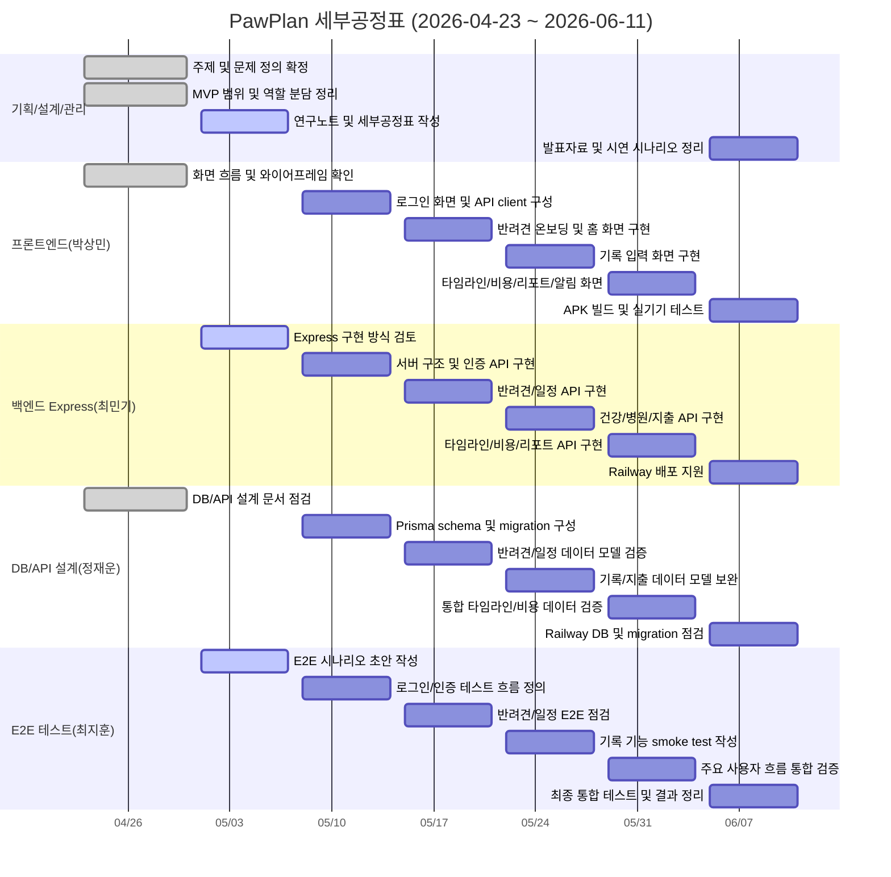

# PawPlan 세부공정표

기간: 2026년 4월 23일 ~ 2026년 6월 11일  
프로젝트명: PawPlan  
작성 기준: `pawplan-project-plan.md`의 추진계획 및 역할 분담 기준  
팀 구성: 4명

---

## 1. 작성 기준

본 세부공정표는 프로젝트 계획서의 개발 추진전략과 추진계획을 기준으로, 2026년 4월 23일부터 6월 11일까지 수행할 세부 작업을 정리한 것이다.

연구노트 기준으로 현재까지 완료된 범위는 주제 선정, 문제 정의, MVP 기능 범위 확정, 기술 스택 선정, DB/API 설계 방향 정리, 개발 착수 준비까지로 본다. 이후 일정은 Flutter 앱 구현, Express 백엔드 구현, DB/API 구체화, E2E 테스트, 배포 및 발표 준비 중심으로 배치한다.

---

## 2. 역할 구분

| 성명 | 역할 | 주요 담당 업무 | 주요 산출물 |
| --- | --- | --- | --- |
| 최민기 | 백엔드 개발 | Express 서버 구조, JWT 인증, REST API 구현, 파일 업로드/다운로드, Railway 서버 배포 지원 | Express API, 인증 API, 백엔드 코드 |
| 박상민 | 프론트엔드 개발 | Flutter 화면 구현, 상태 관리, API 연동, 로컬 알림, APK 빌드 지원 | Flutter 앱, 화면 UI, APK |
| 최지훈 | 프로젝트 총괄/기획/E2E 테스트 | 일정 관리, 요구사항 조정, 문서 관리, 시연 흐름 구성, E2E smoke test 작성 및 검증 | 계획서, 연구노트, 테스트 결과, 발표자료 |
| 정재운 | 백엔드 DB/API 설계 | PostgreSQL schema, Prisma migration, API 명세 관리, 데이터 모델 검증, seed 데이터 구성 | DB 설계서, Prisma schema, API 명세서 |

---

## 3. 전체 세부공정표

| 주차 | 기간 | 공정 구분 | 세부 공정 | 담당 | 산출물 | 완료 기준 | 상태 |
| --- | --- | --- | --- | --- | --- | --- | --- |
| 1주차 | 4/23 ~ 4/30 | 기획/설계 마무리 | 주제 선정, 문제 정의, 사용자 대상 재확인 | 최지훈, 전원 | 문제 정의, 기획 방향 | 프로젝트 주제와 사용자 문제 확정 | 완료 |
| 1주차 | 4/23 ~ 4/30 | 기획/설계 마무리 | MVP 기능 범위와 제외 기능 정리 | 최지훈 | MVP 기능 목록 | 핵심 기능과 향후 기능 구분 완료 | 완료 |
| 1주차 | 4/23 ~ 4/30 | DB/API 설계 | DB schema 초안 및 API 흐름 점검 | 정재운, 최지훈 | DB 설계서, API 명세서 | 주요 테이블과 API 흐름 확인 | 완료 |
| 1주차 | 4/23 ~ 4/30 | 화면 설계 | 주요 화면 흐름과 와이어프레임 확인 | 박상민, 최지훈 | 와이어프레임 | 로그인, 홈, 기록 화면 흐름 정리 | 완료 |
| 2주차 | 5/1 ~ 5/7 | 개발 착수 준비 | Flutter, Express, PostgreSQL, Prisma 개발 방식 정리 | 전원 | 개발 방식 정리 | 기술 스택 및 역할 분담 확정 | 진행 |
| 2주차 | 5/1 ~ 5/7 | 문서화 | 개인별 연구노트 및 세부공정표 작성 | 최지훈, 전원 | 연구노트, 세부공정표 | 담당 분야별 개발 목표 정리 | 진행 |
| 2주차 | 5/1 ~ 5/7 | 테스트 준비 | E2E 테스트 범위와 시나리오 초안 작성 | 최지훈 | E2E 체크리스트 | 로그인부터 기본 조회까지 테스트 흐름 정의 | 진행 |
| 2주차 | 5/1 ~ 5/7 | 개발 구조 점검 | API 명세, DB schema, Flutter 화면 모델 연결 기준 확인 | 최민기, 박상민, 정재운 | 연동 기준 정리 | 요청/응답 필드 기준 확인 | 진행 |
| 3주차 | 5/8 ~ 5/14 | 백엔드 기초 구현 | Express 서버 구조 및 공통 라우터 구성 | 최민기 | 백엔드 기본 서버 | health check 및 기본 라우팅 확인 | 예정 |
| 3주차 | 5/8 ~ 5/14 | 인증 구현 | 회원가입, 로그인, JWT 인증 API 구현 | 최민기 | 인증 API | 로그인 후 인증 API 호출 가능 | 예정 |
| 3주차 | 5/8 ~ 5/14 | DB 구현 | Prisma schema 및 PostgreSQL migration 구성 | 정재운 | Prisma schema, migration | 핵심 테이블 생성 확인 | 예정 |
| 3주차 | 5/8 ~ 5/14 | 프론트 기초 구현 | Flutter 로그인 화면 및 API client 구성 | 박상민 | 로그인 화면, API client | 앱에서 서버 로그인 요청 가능 | 예정 |
| 4주차 | 5/15 ~ 5/21 | 반려견 관리 | 반려견 등록, 조회, 수정 API 구현 | 최민기, 정재운 | 반려견 API | 사용자별 반려견 조회 가능 | 예정 |
| 4주차 | 5/15 ~ 5/21 | 프론트 구현 | 반려견 온보딩 및 홈 화면 구성 | 박상민 | 온보딩 화면, 홈 화면 | 반려견 등록 후 홈 이동 가능 | 예정 |
| 4주차 | 5/15 ~ 5/21 | 일정 관리 | 기본 케어 일정 생성 및 조회 기능 구현 | 최민기, 정재운 | 일정 API, 일정 테이블 | 예방 일정 목록 조회 가능 | 예정 |
| 4주차 | 5/15 ~ 5/21 | 테스트 관리 | 반려견 등록 및 일정 조회 E2E 흐름 점검 | 최지훈 | E2E 중간 점검 결과 | API와 앱 흐름 불일치 항목 정리 | 예정 |
| 5주차 | 5/22 ~ 5/28 | 기록 API 구현 | 건강 기록, 병원 방문 기록 API 구현 | 최민기 | 건강/병원 기록 API | 기록 생성 및 조회 가능 | 예정 |
| 5주차 | 5/22 ~ 5/28 | 데이터 모델 보완 | 건강 기록, 병원 방문, 지출 데이터 모델 검증 | 정재운 | schema 보완, API 명세 수정 | 필드명과 관계 구조 정리 | 예정 |
| 5주차 | 5/22 ~ 5/28 | 프론트 구현 | 건강 기록, 병원 방문, 지출 입력 화면 구현 | 박상민 | 기록 입력 화면 | 앱에서 주요 기록 입력 가능 | 예정 |
| 5주차 | 5/22 ~ 5/28 | 지출 관리 | 지출 기록 API 및 월별 요약 데이터 구현 | 최민기, 정재운 | 지출 API, 요약 데이터 | 지출 입력 및 월별 합계 확인 | 예정 |
| 5주차 | 5/22 ~ 5/28 | 테스트 관리 | 주요 기록 기능 E2E smoke test 작성 | 최지훈 | E2E smoke test | 인증 후 기록 생성/조회 흐름 검증 가능 | 예정 |
| 6주차 | 5/29 ~ 6/4 | 통합 기능 | 건강 기록, 병원 기록, 지출 통합 타임라인 API 구현 | 최민기, 정재운 | 통합 타임라인 API | 날짜순 통합 기록 조회 가능 | 예정 |
| 6주차 | 5/29 ~ 6/4 | 프론트 통합 | 통합 타임라인, 비용 화면, 리포트 화면 구현 | 박상민 | 타임라인/비용/리포트 화면 | 앱에서 주요 요약 화면 확인 가능 | 예정 |
| 6주차 | 5/29 ~ 6/4 | 비용/리포트 | 규칙 기반 비용 예측 및 병원 방문 리포트 API 구현 | 최민기, 정재운 | 비용 예측 API, 리포트 API | 예상 비용과 방문 요약 조회 가능 | 예정 |
| 6주차 | 5/29 ~ 6/4 | 알림 연동 | 케어 일정 기반 로컬 알림 예약 및 취소 구현 | 박상민 | 로컬 알림 기능 | 일정 알림 표시 및 취소 확인 | 예정 |
| 6주차 | 5/29 ~ 6/4 | 통합 검증 | 백엔드 smoke test와 모바일 흐름 점검 | 최지훈 | 테스트 결과 | 주요 사용자 흐름 통과 여부 확인 | 예정 |
| 7주차 | 6/5 ~ 6/11 | 통합 테스트 | 에뮬레이터에서 전체 사용자 흐름 검증 | 최지훈, 박상민 | 통합 테스트 체크리스트 | 로그인부터 기록/요약 조회까지 확인 | 예정 |
| 7주차 | 6/5 ~ 6/11 | 배포 준비 | Railway 백엔드 및 PostgreSQL 배포 설정 점검 | 최민기, 정재운 | 배포 설정, 환경변수 목록 | 배포 서버 health check 확인 | 예정 |
| 7주차 | 6/5 ~ 6/11 | 패키징 | Android APK 빌드 및 실기기 설치 테스트 | 박상민, 최지훈 | APK 파일, 설치 결과 | Android 기기에서 앱 실행 확인 | 예정 |
| 7주차 | 6/5 ~ 6/11 | 최종 정리 | 최종 보고서, 발표자료, 시연 시나리오 정리 | 최지훈, 전원 | 최종 보고서, 발표자료 | 제출 자료 준비 완료 | 예정 |

---

## 4. 간트차트

---

## 5. 주차별 핵심 목표

| 주차 | 기간 | 핵심 목표 | 판단 기준 |
| --- | --- | --- | --- |
| 1주차 | 4/23 ~ 4/30 | 기획/설계 마무리 | 주제, MVP 범위, DB/API, 화면 흐름이 정리되어야 함 |
| 2주차 | 5/1 ~ 5/7 | 개발 착수 준비 | 역할, 개발 기준, 연구노트, E2E 시나리오가 정리되어야 함 |
| 3주차 | 5/8 ~ 5/14 | 로그인 및 기본 서버 연동 | 앱에서 백엔드 로그인 요청을 보낼 수 있어야 함 |
| 4주차 | 5/15 ~ 5/21 | 반려견 등록 및 일정 기반 마련 | 반려견 등록 후 기본 케어 일정 확인이 가능해야 함 |
| 5주차 | 5/22 ~ 5/28 | 주요 기록 기능 구현 | 건강, 병원, 지출 기록을 입력하고 조회할 수 있어야 함 |
| 6주차 | 5/29 ~ 6/4 | 통합 기능 구현 | 타임라인, 비용 예측, 방문 리포트, 로컬 알림이 연결되어야 함 |
| 7주차 | 6/5 ~ 6/11 | 테스트, 배포, 제출 준비 | E2E 테스트, APK 실행, 배포 점검, 발표자료 준비가 완료되어야 함 |

---

## 6. 담당자별 주요 작업 요약

| 담당자 | 4/23 ~ 4/30 | 5/1 ~ 5/7 | 5/8 ~ 5/14 | 5/15 ~ 5/21 | 5/22 ~ 5/28 | 5/29 ~ 6/4 | 6/5 ~ 6/11 |
| --- | --- | --- | --- | --- | --- | --- | --- |
| 최민기 | 백엔드 구현 범위 검토 | Express 구현 방식 검토 | 서버 구조, 인증 API | 반려견/일정 API | 기록/지출 API | 타임라인, 비용, 리포트 API | Railway 서버 배포 지원 |
| 박상민 | 화면 흐름 확인 | Flutter 화면 구조 검토 | 로그인 화면, API client | 온보딩, 홈 화면 | 기록 입력 화면 | 타임라인, 비용, 알림 화면 | APK 빌드, 실기기 테스트 |
| 최지훈 | 주제/MVP/일정 정리 | 연구노트, 공정표, E2E 초안 | E2E 시나리오 작성 | 반려견/일정 흐름 점검 | 기록 기능 테스트 작성 | smoke test 및 통합 검증 | 최종 테스트, 발표자료, 시연 |
| 정재운 | DB/API 문서 점검 | DB/API 연동 기준 확인 | Prisma schema, migration | 반려견/일정 데이터 모델 | 기록/지출 모델 보완 | 타임라인/비용 데이터 검증 | Railway DB, migration 점검 |

---

## 7. 주요 산출물 목록

| 구분 | 산출물 | 주 담당 |
| --- | --- | --- |
| 기획/관리 | 프로젝트 계획서, 연구노트, 세부공정표, 발표자료 | 최지훈 |
| 프론트엔드 | Flutter Android 앱, 화면 UI, 로컬 알림, APK | 박상민 |
| 백엔드 | Express REST API, JWT 인증, 비즈니스 로직, 배포 서버 | 최민기 |
| DB/API 설계 | PostgreSQL schema, Prisma migration, API 명세서, seed 데이터 | 정재운 |
| 테스트 | E2E smoke test, 통합 테스트 체크리스트, 테스트 결과 | 최지훈, 전원 |

---

## 8. 일정 관리 유의사항

- 최지훈은 직접 구현 담당보다 프로젝트 총괄, 문서 관리, E2E 테스트, 시연 흐름 정리에 중점을 둔다.
- 최민기는 Express 중심 백엔드 구현을 담당하고, 정재운은 DB schema와 API 명세의 기준을 관리한다.
- 박상민은 Flutter 화면과 사용자 흐름 구현을 담당하며, 백엔드 API 변경 사항을 즉시 반영한다.
- API 변경 시 정재운이 API 명세를 갱신하고, 최지훈이 E2E 테스트 흐름에 반영한다.
- 6월 11일 전에는 신규 기능 추가보다 테스트, 오류 수정, APK 실행, 발표 준비를 우선한다.

