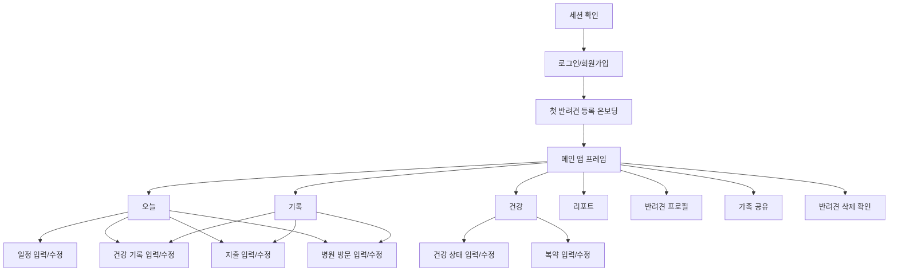

# PawPlan UI 재구성 문서

## 1. 앱 목적

PawPlan은 반려견 보호자가 흩어져 있는 관리 업무를 한 앱 안에서 처리하게 만드는 생활형 관리 도구다. 앱의 핵심 목적은 아래 4가지다.

- 오늘 해야 할 반려견 케어 일정을 빠르게 확인한다.
- 건강 기록, 병원 방문 기록, 지출 기록을 하나의 흐름으로 남기고 다시 찾는다.
- 병원 방문 전후에 필요한 요약 정보를 즉시 확인한다.
- 가족 구성원과 반려견 관리 권한을 안전하게 공유한다.

즉, 이 앱은 "기록 앱"이 아니라 "반려견 관리 실행 앱"으로 봐야 한다. 첫 화면에서 사용자는 오늘 해야 할 일, 최근 건강 상태, 최근 비용 흐름, 바로 입력할 수 있는 빠른 액션을 동시에 받아야 한다.

## 2. UI 재구성 목표

- 매일 쓰는 화면과 가끔 쓰는 관리 화면을 분리한다.
- 입력은 빠르게, 조회는 한눈에, 수정과 삭제는 명확하게 만든다.
- 건강, 병원, 지출 데이터를 따로 놀게 두지 않고 하나의 반려견 타임라인으로 묶는다.
- 프로필 수정, 가족 공유, 삭제 같은 관리 기능은 메인 행동 흐름을 방해하지 않게 뒤로 뺀다.
- 탭 구조는 단순하게 유지하되 각 탭의 역할이 겹치지 않게 만든다.

## 3. 권장 정보 구조

### 3.1 진입 흐름

1. 세션 확인
2. 로그인/회원가입
3. 첫 반려견 등록 온보딩
4. 메인 앱 진입

### 3.2 메인 구조

- `오늘`
- `기록`
- `건강`
- `리포트`

### 3.3 관리 구조

- 반려견 프로필
- 가족 공유
- 반려견 삭제 확인
- 각종 입력/수정 화면
  - 일정
  - 건강 기록
  - 병원 방문
  - 지출
  - 건강 상태
  - 복약

현재 코드도 큰 틀은 이 구조를 따르고 있다. UI 재구성에서는 이 구조를 유지하되, 현재 대화상자 중심 입력 화면 중 일부는 전체 화면 폼 또는 바텀시트로 바꾸는 것이 더 적합하다.

## 4. 필요한 페이지와 필수 요소

### 4.1 세션 확인 화면

목적: 앱 시작 시 세션 복원 여부를 판단하고 다음 화면으로 자연스럽게 연결한다.

필수 요소:

- 앱 로고와 서비스명
- 로딩 인디케이터
- "세션 확인 중" 상태 문구
- 세션 복원 실패 시 재시도 또는 로그아웃 처리
- 네트워크 오류 안내

### 4.2 로그인/회원가입 화면

목적: 신규 사용자는 빠르게 가입하고, 기존 사용자는 즉시 앱으로 복귀하게 만든다.

필수 요소:

- 브랜드 메시지와 서비스 한 줄 설명
- 로그인/회원가입 전환 토글
- 이메일 입력
- 비밀번호 입력
- 회원가입 시 이름 입력
- 제출 버튼
- 오류 메시지 영역
- API 연결 상태 또는 도움말 문구
- 내부 테스트용이라면 데모 계정 진입 힌트

권장 포인트:

- 왼쪽은 브랜드/가치 제안, 오른쪽은 입력 폼으로 분리한다.
- 로그인과 회원가입을 한 화면 안에서 토글하되 입력 길이는 짧게 유지한다.

### 4.3 첫 반려견 등록 온보딩 화면

목적: 앱 사용을 시작하기 위한 최소 반려견 정보를 입력받고 초기 관리 기준을 만든다.

필수 요소:

- 진행 상태 표시
- 반려견 이름
- 견종
- 생년월일
- 성별
- 중성화 여부
- 현재 체중
- 활동량
- 보험 상태
- 완료 버튼
- 이전 단계 또는 나가기

재구성 권장:

- 현재 단일 폼보다 `기본 정보 > 생활 정보 > 건강 기본값` 3단계로 나누는 편이 낫다.
- 건강 기본값 단계에는 초기 질환/복약 여부를 간단히 추가하는 것이 좋다.
- 완료 직후에는 "초기 일정 생성 완료"와 "예상 관리 비용" 요약을 바로 보여준다.

### 4.4 메인 앱 프레임

목적: 반려견 전환, 상위 관리 액션, 메인 탭 이동을 담당하는 공통 구조다.

필수 요소:

- 앱 바
- 현재 선택된 반려견 표시
- 반려견 전환 드롭다운
- 새로고침 액션
- 로그아웃 또는 계정 메뉴
- 반려견 프로필 진입
- 가족 공유 진입
- 병원 방문 리포트 빠른 생성 액션
- 4개 메인 탭 전환 컨트롤

권장 포인트:

- 반려견 전환은 상단 공통 영역에 고정한다.
- 메인 탭은 하단 탭 또는 상단 세그먼트 중 하나로 통일한다.
- 프로필/공유/삭제 같은 관리 액션은 오버플로 메뉴 한 곳에 묶는 편이 더 깔끔하다.

### 4.5 오늘 화면

목적: 사용자가 오늘 해야 할 일과 바로 남겨야 할 기록을 가장 빠르게 처리하는 핵심 화면이다.

필수 요소:

- 반려견 요약 히어로 영역
  - 이름
  - 견종
  - 현재 체중
  - 보호자 권한 상태
- 핵심 지표 카드
  - 이번 달 지출
  - 남은 일정 수
  - 6개월 비용 예측
- 오늘/예정 일정 리스트
  - 일정 제목
  - 일정 유형
  - 날짜
  - 우선순위
  - 완료 버튼
  - 건너뛰기 버튼
  - 수정 버튼
- 최근 건강 기록 미리보기
- 빠른 건강 기록 입력 영역
- 빠른 지출 입력 영역
- 빠른 병원 방문 입력 영역
- 병원 방문 리포트 생성 버튼
- 빈 상태 안내

권장 포인트:

- 이 화면은 "조회"보다 "실행" 중심이어야 한다.
- 일정, 건강 기록, 지출 입력 CTA가 한 화면 안에서 끊기지 않아야 한다.

### 4.6 기록 화면

목적: 건강, 병원, 지출 기록을 시간 흐름으로 탐색하고 수정하는 화면이다.

필수 요소:

- 기록 요약
  - 건강 기록 수
  - 병원 방문 수
  - 누적 지출
- 통합 타임라인
- 필터
  - 전체
  - 건강
  - 병원
  - 지출
- 건강 기록 리스트
- 병원 방문 기록 리스트
- 지출 기록 리스트
- 각 항목의 수정/삭제 액션
- 병원 방문 항목의 첨부파일 영역
  - 첨부파일 목록
  - 업로드
  - 삭제

권장 포인트:

- 통합 타임라인이 이 화면의 중심이고, 개별 섹션은 상세 열람 성격으로 둔다.
- 병원 방문과 연결된 첨부파일은 별도 깊은 화면보다 리스트 내부 확장형이 좋다.

### 4.7 건강 기록 입력/수정 화면

목적: 식욕, 배변, 체중, 증상 같은 일상 건강 데이터를 빠르게 남긴다.

필수 요소:

- 기록 유형 선택
- 제목
- 수치 입력
- 단위 입력
- 메모
- 저장 버튼
- 취소 버튼

권장 포인트:

- 자주 쓰는 유형은 프리셋 버튼으로 노출한다.
- 숫자 입력이 필요한 항목과 메모형 항목을 시각적으로 구분한다.

### 4.8 병원 방문 입력/수정 화면

목적: 진료 전후 핵심 정보를 구조적으로 남기고 나중에 리포트 생성에 활용한다.

필수 요소:

- 병원명
- 방문 사유
- 증상
- 진단/소견
- 처치/치료
- 처방/복약 항목
- 추후 내원일
- 메모
- 저장 버튼
- 삭제 액션

추가 권장 요소:

- 진료비 연결 입력
- 영수증/처방전/검사 결과 첨부
- 리포트 생성 바로가기

### 4.9 지출 입력/수정 화면

목적: 반려견 관련 비용을 카테고리별로 남기고 비용 예측의 기반 데이터를 만든다.

필수 요소:

- 지출 카테고리
- 금액
- 지출일
- 사용처
- 메모
- 저장 버튼
- 삭제 액션

권장 포인트:

- 병원 방문에서 발생한 비용은 병원 방문 입력 흐름과 자연스럽게 연결되는 편이 좋다.
- 자주 쓰는 카테고리는 칩 또는 아이콘형 선택으로 바꾸는 것이 입력 속도에 유리하다.

### 4.10 건강 화면

목적: 장기적으로 관리해야 하는 건강 상태와 복약 정보를 분리해서 관리한다.

필수 요소:

- 건강 정보 요약
  - 관리 중 상태 수
  - 복약 중 수
  - 전체 기록 수
- 건강 상태 리스트
  - 상태명
  - 유형
  - 심각도
  - 상태값
  - 진단일
  - 메모
  - 수정/삭제
- 복약 리스트
  - 약 이름
  - 용량
  - 복용 주기
  - 시작일
  - 종료일
  - 처방 병원
  - 복용 중 여부
  - 메모
  - 수정/삭제
- 건강 상태 추가 버튼
- 복약 추가 버튼

권장 포인트:

- 일상 기록과 장기 관리 정보를 명확히 분리해 사용자가 헷갈리지 않게 해야 한다.
- 배지는 심각도와 복용 여부처럼 "지금 상태"를 바로 읽게 만드는 용도로만 쓴다.

### 4.11 건강 상태 입력/수정 화면

목적: 알레르기, 만성질환, 증상 추적 같은 장기 상태를 구조화해서 저장한다.

필수 요소:

- 상태 유형
- 상태명
- 심각도
- 진단일
- 상태값
- 메모
- 저장 버튼

### 4.12 복약 입력/수정 화면

목적: 복약 시작, 종료, 현재 복용 여부를 관리한다.

필수 요소:

- 약 이름
- 용량
- 복용 주기
- 시작일
- 종료일
- 처방 병원 또는 처방처
- 현재 복용 중 스위치
- 메모
- 저장 버튼

### 4.13 리포트 화면

목적: 병원 방문 요약과 비용 예측을 확인하는 분석 화면이다.

필수 요소:

- 최신 병원 방문 리포트 카드
  - 리포트 제목
  - 최근 증상 요약
  - 최근 방문 건수
  - 안내 문구
- 리포트 생성 버튼
- 리포트 이력 리스트
- 비용 예측 요약
  - 월 예상
  - 6개월 예상
  - 연 예상
  - 예측 범위
  - 신뢰도
  - 생애 예상 비용
- 비용 구성 breakdown
  - 고정비
  - 계획 케어 비용
  - 건강 리스크 비용
- 예측 재계산 버튼
- 예측 이력 리스트
- 면책 또는 참고 안내 문구

권장 포인트:

- 이 화면은 "숫자 확인"보다 "다음 의사결정 지원"이 목적이어야 한다.
- 최신 리포트와 최신 예측을 화면 상단에서 바로 읽게 하고, 이력은 그 아래로 내린다.

### 4.14 반려견 프로필 화면

목적: 반려견의 기준 정보와 생활 특성을 수정하는 관리 화면이다.

필수 요소:

- 이름
- 견종
- 생년월일
- 성별
- 중성화 여부
- 현재 체중
- 목표 체중
- 활동량
- 보험 상태
- 메모
- 저장 버튼

권장 포인트:

- 이 화면은 메인 작업 흐름 밖의 "설정형 화면"으로 분리하는 편이 낫다.
- 프로필 편집은 일정/기록 입력보다 차분한 레이아웃이 어울린다.

### 4.15 가족 공유 화면

목적: 반려견 관리 권한을 가족과 나누고 역할을 제어한다.

필수 요소:

- 현재 멤버 목록
- 멤버 이름/이메일
- 내 계정 표시
- 역할 표시
  - 보기
  - 편집
  - 보호자
- 이메일로 멤버 추가
- 추가할 역할 선택
- 역할 변경
- 멤버 제거
- 권한 부족 안내

권장 포인트:

- 초대, 역할 변경, 제거가 한 화면 안에서 끝나야 한다.
- 보호자 권한만 가능한 액션은 비활성화 이유를 명확히 보여줘야 한다.

### 4.16 반려견 삭제 확인 화면

목적: 실수 삭제를 방지하고 삭제 범위를 명확히 보여준다.

필수 요소:

- 삭제 경고 문구
- 삭제되는 데이터 요약
  - 일정 수
  - 건강 상태 수
  - 복약 수
  - 건강 기록 수
  - 병원 방문 수
  - 지출 수
  - 리포트 수
  - 첨부파일 수와 용량
- 반려견 이름 직접 입력 확인
- 영구 삭제 버튼
- 취소 버튼

## 5. 공통 컴포넌트와 공통 상태

모든 페이지에서 공통으로 필요한 요소:

- 로딩 상태
- 빈 상태
- 오류 상태
- 저장 성공/실패 피드백
- 삭제 확인
- 날짜 입력 컴포넌트
- 숫자 입력 컴포넌트
- 권한별 비활성 상태 표시
- 첨부파일 업로드 상태
- 당겨서 새로고침 또는 수동 새로고침

UI 재구성 시에는 이 공통 요소를 먼저 디자인 시스템처럼 정리한 뒤 페이지에 적용하는 편이 낫다.

## 6. 재구성 우선순위

1. 로그인/온보딩 정리
2. 메인 앱 프레임과 오늘 화면 정리
3. 기록 화면과 병원 방문 입력 흐름 정리
4. 건강 화면 정리
5. 리포트 화면 정리
6. 프로필/가족 공유/삭제 같은 관리 화면 정리

이 순서가 좋은 이유는 매일 쓰는 흐름부터 품질을 올려야 사용성이 바로 개선되기 때문이다. 특히 `오늘 화면`, `기록 화면`, `병원 방문 입력 화면` 세 개가 앱 인상을 사실상 결정한다.
