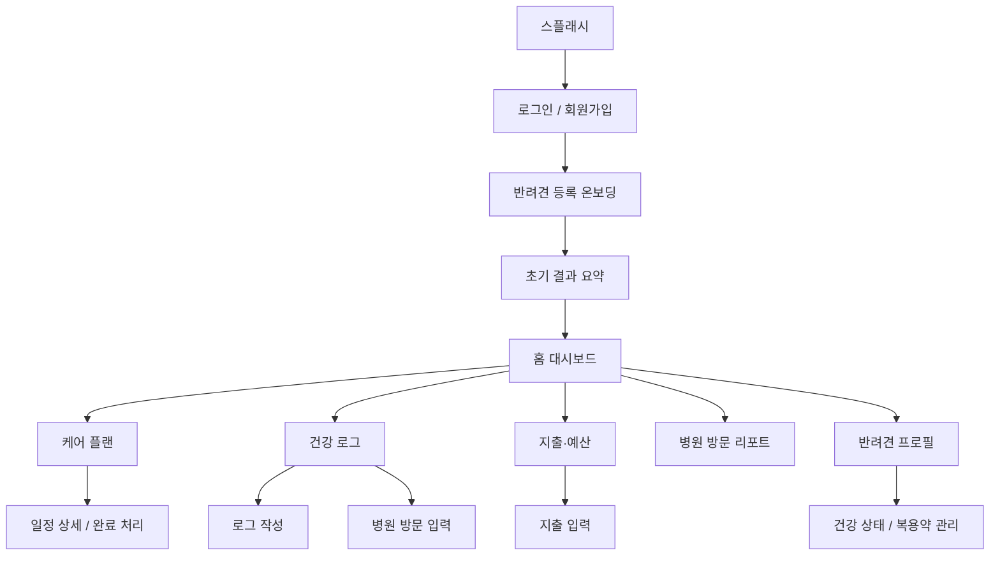

# PawPlan 화면 와이어프레임

작성일: 2026-04-21  
대상: 모바일 앱 MVP 기준  
형식: 저충실도 와이어프레임 + 화면 흐름 정의

---

## 1. 목적

이 문서는 PawPlan의 핵심 화면을 `개발 가능한 수준`으로 정리한 와이어프레임 문서다.  
디자인 스타일을 정하는 문서가 아니라 아래를 명확히 하기 위한 문서다.

- 어떤 화면이 필요한가
- 각 화면에 어떤 정보가 들어가는가
- 화면 간 이동 흐름은 어떻게 되는가
- MVP에서 무엇을 우선 구현해야 하는가

---

## 2. 전체 화면 구조

## 2.1 앱 구조 개요



## 2.2 하단 탭 구조

MVP 기준 하단 탭은 4개를 권장한다.

- `홈`
- `케어`
- `로그`
- `예산`

병원 방문 리포트와 프로필은 홈 또는 상단 우측 메뉴에서 진입하게 하면 탭 수를 줄일 수 있다.

---

## 3. 핵심 사용자 흐름

### 3.1 첫 사용자 흐름
1. 로그인
2. 반려견 등록
3. 건강 배경 입력
4. 서버가 초기 케어 일정과 비용 예측을 한 번에 생성
5. 초기 결과 요약 확인
6. 홈 대시보드 진입

### 3.2 일상 사용 흐름
1. 홈에서 오늘 할 일 확인
2. 통합 타임라인 확인
3. 식단/산책/체중/증상 로그 추가 또는 병원 방문 기록 추가
4. 지출 입력
5. 예산 변화 및 다음 일정 확인

### 3.3 병원 방문 직전 흐름
1. 홈에서 병원 방문 리포트 진입
2. 최근 건강 로그와 병원 기록 자동 요약 확인
3. 화면 공유 또는 텍스트 공유

---

## 4. 화면 목록

MVP 기준 필수 화면은 아래 11개다.

1. 스플래시 / 로그인
2. 회원가입
3. 반려견 등록 온보딩
4. 초기 결과 요약
5. 홈 대시보드
6. 케어 플랜 캘린더
7. 건강 로그 타임라인
8. 로그 입력 화면
9. 병원 방문 입력 화면
10. 지출·예산 화면
11. 병원 방문 리포트

있으면 좋은 확장 화면:

- 반려견 프로필 상세
- 병원 방문 기록 상세
- 설정 / 가족 공유

---

## 5. 화면별 와이어프레임

## 5.1 스플래시 / 로그인

목적:

- 앱 진입
- 로그인 또는 회원가입 시작

핵심 요소:

- 앱 로고
- 서비스 한 줄 설명
- 이메일 로그인
- 회원가입 버튼

```text
+--------------------------------------------------+
|                    PawPlan                       |
|        반려견 케어 · 예산 관리 앱               |
|                                                  |
|            [ 이메일 ] [ 비밀번호 ]              |
|                                                  |
|              [ 로그인 버튼 ]                     |
|                                                  |
|              [ 회원가입 ]                        |
|                                                  |
|      예방 일정과 평생 비용을 함께 관리하세요     |
+--------------------------------------------------+
```

비고:

- MVP에서는 소셜 로그인을 빼고 이메일 로그인만 구현해도 충분하다.

---

## 5.2 회원가입

목적:

- 사용자 계정 생성

핵심 요소:

- 이름
- 이메일
- 비밀번호
- 비밀번호 확인

```text
+--------------------------------------------------+
|                  회원가입                        |
|                                                  |
|  이름 입력                                       |
|  이메일 입력                                     |
|  비밀번호 입력                                   |
|  비밀번호 확인                                   |
|                                                  |
|              [ 가입하기 ]                        |
+--------------------------------------------------+
```

---

## 5.3 반려견 등록 온보딩

목적:

- 반려견 기본 정보와 건강 배경 입력
- 초기 케어 플랜 생성의 기준 마련

구성:

- Step 1: 기본 정보
- Step 2: 건강 배경
- Step 3: 보험/메모

### Step 1: 기본 정보

```text
+--------------------------------------------------+
|               반려견 등록 1/3                    |
|                                                  |
|  이름                                            |
|  품종                                            |
|  생년월일 또는 나이                              |
|  성별                                            |
|  중성화 여부                                     |
|  현재 체중                                       |
|                                                  |
|         [ 이전 ]              [ 다음 ]           |
+--------------------------------------------------+
```

### Step 2: 건강 배경

```text
+--------------------------------------------------+
|               반려견 등록 2/3                    |
|                                                  |
|  알레르기 있음 / 없음                            |
|  기저질환 있음 / 없음                            |
|  현재 복용약 있음 / 없음                         |
|  특이사항 메모                                   |
|                                                  |
|         [ 이전 ]              [ 다음 ]           |
+--------------------------------------------------+
```

### Step 3: 보험 및 마무리

```text
+--------------------------------------------------+
|               반려견 등록 3/3                    |
|                                                  |
|  보험 가입 여부                                  |
|  보호자 메모                                     |
|                                                  |
|  등록 완료 후                                    |
|  - 초기 케어 일정 생성                           |
|  - 예상 비용 요약 제공                           |
|                                                  |
|         [ 이전 ]           [ 등록 완료 ]         |
+--------------------------------------------------+
```

비고:

- 입력 후 바로 홈으로 보내지 말고, "초기 결과 화면"을 짧게 보여주는 것이 좋다.

### 초기 결과 요약

```text
+--------------------------------------------------+
|               초기 설정 완료                     |
|--------------------------------------------------|
| 코코의 기본 케어 일정이 생성되었습니다.          |
|                                                  |
| - 이번 달 해야 할 일정 3건                       |
| - 월 예상 비용 210,000원                         |
| - 연 예상 비용 2,400,000원                       |
|                                                  |
|           [ 홈으로 이동 ]                        |
+--------------------------------------------------+
```

---

## 5.4 홈 대시보드

목적:

- 앱의 핵심 정보를 한 화면에서 요약 제공

핵심 섹션:

- 오늘의 케어 일정
- 최근 건강 상태
- 이번 달 지출
- 최신 비용 예측
- 병원 방문 리포트 바로가기

```text
+--------------------------------------------------+
| [강아지 선택 ▼]                     [프로필]     |
|--------------------------------------------------|
| 오늘 할 일                                       |
| - 심장사상충 예방약 복용                         |
| - 체중 기록 입력                                 |
|                                      [전체보기]  |
|--------------------------------------------------|
| 최근 건강 상태                                   |
| - 어제 산책 35분                                 |
| - 오늘 체중 4.8kg                                |
| - 최근 증상 메모 없음                            |
|--------------------------------------------------|
| 이번 달 지출                                     |
|  182,000원                                       |
|  병원 80,000 / 사료 52,000 / 용품 50,000         |
|                                      [예산 보기] |
|--------------------------------------------------|
| 예상 비용 요약                                   |
|  월 예상 210,000원                               |
|  연 예상 2,400,000원                             |
|                                      [상세 보기] |
|--------------------------------------------------|
|            [ 병원 방문 리포트 만들기 ]           |
+--------------------------------------------------+
|   홈          케어          로그          예산   |
+--------------------------------------------------+
```

비고:

- 홈은 "무엇을 입력하는 화면"이 아니라 "무엇을 해야 하는지 알려주는 화면"으로 유지해야 한다.

---

## 5.5 케어 플랜 캘린더

목적:

- 예방 일정과 정기 관리 일정을 한눈에 확인

핵심 요소:

- 월간 캘린더
- 오늘/다가오는 일정 리스트
- 완료 처리 버튼

```text
+--------------------------------------------------+
|                 케어 플랜                        |
|--------------------------------------------------|
|                [ 2026년 4월 ]                    |
|                                                  |
|   캘린더 영역                                    |
|   1  2  3  4  5                                  |
|   6  7  8  9 10                                  |
|   ...                                            |
|                                                  |
|--------------------------------------------------|
| 다가오는 일정                                    |
| - 4/23 광견병 예방접종                           |
| - 4/25 심장사상충 예방                           |
| - 4/28 정기 검진                                 |
|                                                  |
| [완료 처리] [상세 보기]                          |
+--------------------------------------------------+
|   홈          케어          로그          예산   |
+--------------------------------------------------+
```

### 일정 상세 화면

```text
+--------------------------------------------------+
|             일정 상세                            |
|--------------------------------------------------|
| 광견병 예방접종                                  |
| 날짜: 2026-04-23                                 |
| 우선순위: 높음                                   |
| 설명: 연 1회 권장되는 예방 일정                  |
|                                                  |
| [완료 처리]  [건너뛰기]  [수정]                  |
+--------------------------------------------------+
```

---

## 5.6 건강 로그 타임라인

목적:

- 병원/생활 기록을 시간순으로 확인

핵심 요소:

- 날짜별 타임라인
- 로그 필터
- 빠른 작성 버튼
- 병원 방문 요약 카드

```text
+--------------------------------------------------+
|                  건강 로그                       |
|--------------------------------------------------|
| [전체] [식단] [체중] [산책] [증상] [병원]        |
|--------------------------------------------------|
| 2026-04-21                                       |
| - 체중 기록: 4.8kg                               |
| - 산책: 35분                                     |
| - 식단: 사료 80g                                 |
|--------------------------------------------------|
| 2026-04-20                                       |
| - 병원 방문: 피부 가려움 상담                    |
| - 처방약 복용 시작                               |
|--------------------------------------------------|
|                 [ + 로그 작성 ]                  |
+--------------------------------------------------+
|   홈          케어          로그          예산   |
+--------------------------------------------------+
```

비고:

- 이 화면은 `health_logs`와 `medical_visits`를 합쳐 보여주는 통합 타임라인 화면이다.
- 병원 방문 기록은 별도 입력 화면에서 생성하고, 타임라인에는 요약 카드만 보여주는 구조가 좋다.

---

## 5.7 로그 입력 화면

목적:

- 다양한 건강 로그를 하나의 흐름으로 입력

구성:

- 로그 타입 선택
- 공통 입력 필드
- 타입별 상세 필드

```text
+--------------------------------------------------+
|                 로그 작성                        |
|--------------------------------------------------|
| 로그 유형                                        |
| [식단] [체중] [산책] [증상] [메모]               |
|--------------------------------------------------|
| 날짜/시간                                        |
| 메모                                             |
| 첨부 이미지                                      |
|--------------------------------------------------|
| 유형별 필드                                      |
| 예: 체중 선택 시                                 |
| - 체중 값                                        |
| - 단위 kg                                        |
|                                                  |
| 예: 식단 선택 시                                 |
| - 사료명                                         |
| - 급여량                                         |
|                                                  |
|                 [ 저장 ]                         |
+--------------------------------------------------+
```

비고:

- 병원 방문은 별도 화면에서 입력한다.

## 5.8 병원 방문 입력 화면

목적:

- 병원 진료 정보를 구조화해서 기록
- 필요 시 병원비 지출도 함께 생성

```text
+--------------------------------------------------+
|               병원 방문 기록                     |
|--------------------------------------------------|
| 병원명                                           |
| 방문일시                                         |
| 방문 사유                                        |
| 증상                                             |
| 진단 내용                                        |
| 처방 내용                                        |
| 재방문 예정일                                    |
|--------------------------------------------------|
| [진료비도 함께 입력] 체크                        |
| 금액 / 사용처 / 메모                             |
|--------------------------------------------------|
|                  [ 저장 ]                        |
+--------------------------------------------------+
```

---

## 5.9 지출·예산 화면

목적:

- 실제 지출과 예상 비용을 함께 제공

핵심 섹션:

- 이번 달 총 지출
- 카테고리별 지출
- 월/연/평생 예상 비용
- 시나리오 비교

```text
+--------------------------------------------------+
|                  지출·예산                       |
|--------------------------------------------------|
| 이번 달 총 지출                                  |
| 182,000원                                        |
|--------------------------------------------------|
| 카테고리별 지출                                  |
| - 병원 80,000                                    |
| - 사료 52,000                                    |
| - 미용 30,000                                    |
| - 용품 20,000                                    |
|--------------------------------------------------|
| 예상 비용                                        |
| 월 210,000 / 연 2,400,000 / 평생 18,000,000      |
|--------------------------------------------------|
| 시나리오 비교                                    |
| 기본 / 주의 / 고위험                             |
|--------------------------------------------------|
|            [ + 지출 입력 ]                       |
+--------------------------------------------------+
|   홈          케어          로그          예산   |
+--------------------------------------------------+
```

### 지출 입력 화면

```text
+--------------------------------------------------+
|                 지출 입력                        |
|--------------------------------------------------|
| 날짜                                             |
| 카테고리                                         |
| 금액                                             |
| 사용처                                           |
| 메모                                             |
| 영수증 첨부                                      |
|                                                  |
|                 [ 저장 ]                         |
+--------------------------------------------------+
```

---

## 5.10 병원 방문 리포트

목적:

- 병원 가기 전에 보호자가 보여줄 정보를 자동 요약

핵심 섹션:

- 반려견 기본 정보
- 최근 증상
- 최근 체중 변화
- 현재 복용약
- 주요 병력 / 알레르기
- 최근 병원 방문

```text
+--------------------------------------------------+
|             병원 방문 리포트                     |
|--------------------------------------------------|
| 반려견: 코코 / 말티즈 / 6세 / 4.8kg             |
|--------------------------------------------------|
| 최근 증상                                        |
| - 3일 전부터 귀를 자주 긁음                      |
| - 산책 후 발을 자주 핥음                         |
|--------------------------------------------------|
| 최근 체중 변화                                   |
| - 지난달 4.6kg -> 현재 4.8kg                     |
|--------------------------------------------------|
| 현재 복용약                                      |
| - 피부약 하루 2회                                |
|--------------------------------------------------|
| 알레르기 / 기저질환                              |
| - 닭고기 알레르기                                |
|--------------------------------------------------|
| 최근 병원 방문                                   |
| - 2026-04-03 피부 진료                           |
|                                                  |
|            [ 공유 ]   [ 닫기 ]                   |
+--------------------------------------------------+
```

비고:

- 이 화면은 발표 데모 포인트가 강하므로 읽기 쉽고 간단해야 한다.
- PDF 저장은 2차 확장 기능으로 미룬다.

---

## 5.11 반려견 프로필 상세

목적:

- 프로필 및 건강 배경 정보 확인/수정

핵심 요소:

- 기본 프로필
- 건강 상태
- 복용약
- 리스크 카드

```text
+--------------------------------------------------+
|                반려견 프로필                     |
|--------------------------------------------------|
| 이름 / 품종 / 나이 / 체중                        |
| 성별 / 중성화 / 보험 상태                        |
|--------------------------------------------------|
| 건강 상태                                        |
| - 알레르기                                       |
| - 기저질환                                       |
| - 현재 복용약                                    |
|--------------------------------------------------|
| 품종 기반 리스크 카드                            |
| - 피부 질환 주의                                 |
| - 치아 관리 필요                                 |
|                                                  |
|                 [ 수정 ]                         |
+--------------------------------------------------+
```

---

## 6. 개발 우선순위

### 6.1 1차 구현 화면
- 로그인 / 회원가입
- 반려견 등록 온보딩
- 초기 결과 요약
- 홈 대시보드
- 케어 플랜 캘린더
- 건강 로그 타임라인
- 로그 입력 화면
- 병원 방문 입력 화면
- 지출·예산 화면
- 병원 방문 리포트

### 6.2 2차 구현 화면
- 반려견 프로필 상세
- 일정 상세
- 지출 입력 상세

---

## 7. 컴포넌트 재사용 기준

재사용 가능한 컴포넌트를 먼저 정해두면 구현 속도가 빨라진다.

- `DogSelector`: 강아지 선택 드롭다운
- `InfoCard`: 홈/예산/리포트 요약 카드
- `SectionHeader`: 섹션 제목 + 더보기
- `ScheduleItem`: 일정 카드
- `LogItem`: 건강 로그 카드
- `ExpenseItem`: 지출 카드
- `PrimaryButton`: 기본 CTA 버튼
- `EmptyState`: 데이터 없을 때 공통 화면

---

## 8. 화면 설계 시 주의점

- 홈에는 입력 필드를 많이 넣지 않는다.
- 기록 화면은 빠른 입력이 핵심이다.
- 예산 화면은 숫자가 많아질 수 있으므로 `이번 달`, `예상`, `비교` 세 블록으로 끊는다.
- 병원 리포트는 텍스트를 줄이고 항목 중심으로 정리한다.
- 모든 주요 화면은 스크롤 2회 이내에 핵심 정보가 보여야 한다.

---

## 9. 한 줄 정리

PawPlan의 화면 구조는  
`홈에서 해야 할 일을 보고 -> 로그를 쌓고 -> 예산을 확인하고 -> 필요 시 병원 리포트를 생성하는 흐름`으로 설계하는 것이 가장 자연스럽다.
